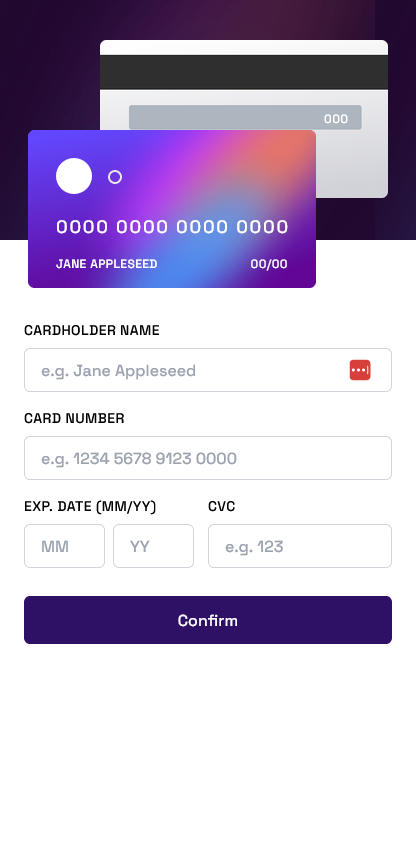

# Frontend Mentor - Interactive card details form solution

This is a solution to the [Interactive card details form challenge on Frontend Mentor](https://www.frontendmentor.io/challenges/interactive-card-details-form-XpS8cKZDWw). Frontend Mentor challenges help you improve your coding skills by building realistic projects.

## Table of contents

- [Overview](#overview)
  - [The challenge](#the-challenge)
  - [Screenshot](#screenshot)
  - [Links](#links)
- [My process](#my-process)
  - [Built with](#built-with)
  - [What I learned](#what-i-learned)
  - [Continued development](#continued-development)
  - [Useful resources](#useful-resources)
- [Author](#author)

## Overview

### The challenge

Users should be able to:

- Fill in the form and see the card details update in real-time
- Receive error messages when the form is submitted if:
  - Any input field is empty
  - The card number, expiry date, or CVC fields are in the wrong format
- View the optimal layout depending on their device's screen size
- See hover, active, and focus states for interactive elements on the page

### Screenshot

**Desktop View**


**Mobile View**



### Links

- Solution URL: [Github Repo](https://github.com/BinLama/FrontendMentor-interactive-card-details-form/tree/main)
- Live Site URL: [Github Pages](https://binlama.github.io/FrontendMentor-interactive-card-details-form/)

## My process

### Built with

- [Tailwind CSS](https://tailwindcss.com/) - CSS Framework
- Mobile-first workflow
- [React](https://reactjs.org/) - JS library

### What I learned

Tailwind makes writing css easier and less time consuming.

NOTE: **Move Pictures that you want to import in tailwind to public files and use the css below.**

```jsx
<section className="bg-[url('../imagename.type')]">...</section>
```

### Continued development

Going forward, I am going to use Tailwind CSS and React together. These two are powerful tools and I believe that learning them would make many things possible for me.

### Useful resources

- [Tailwind Background image](https://design2tailwind.com/blog/tailwindcss-background-image/) - This helped me add background image on my webpage without breaking it.

## Author

- Frontend Mentor - [@Bin Lama](https://www.frontendmentor.io/profile/BinLama)
- Github - [@BinLama](https://github.com/BinLama)
